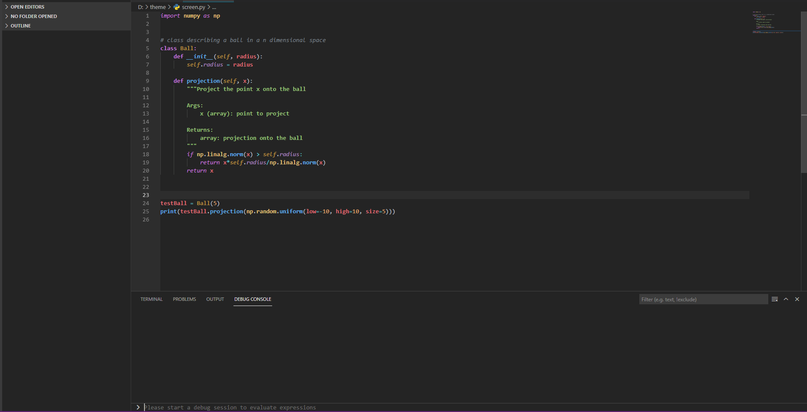

# Darcula + One Dark

* This theme is the background of darcula with the frontground inspired by One Dark Atom theme
* For python and C++
* Syntax highlighting supported, tested with Pylance for Python and the Microsoft C/C++ extension for C++
* Python theme has a no red version
* The python and C++ themes are separated

## Python:

## C++:

**Enjoy!**
